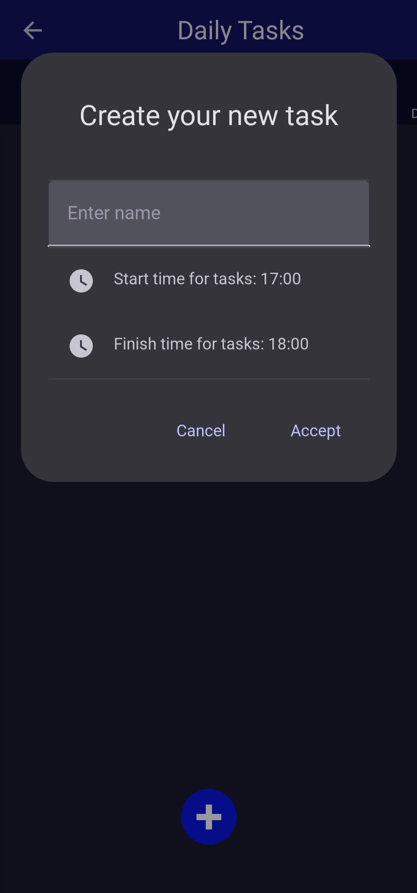
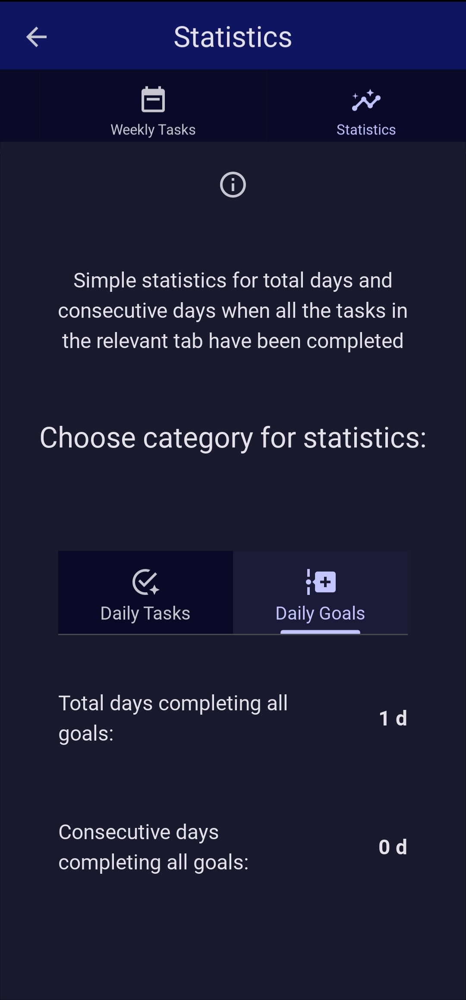

# Task Manager

Task Manager is a mobile application developed using Python with Kivy and KivyMD. The user-friendly interface and smooth performance make it a handy tool for daily task management.

## Screenshots





## Features

- **Task Creation**: Add new tasks with titles, descriptions, and due dates.
- **Timer**: Use pomodoro technique to focus on your tasks better.
- **Statistics**: Watch your progress to stay on track.
- **User-Friendly Interface**: Intuitive design for easy navigation and task management.

## Installation

### Option 1: On local machine

To run the 'Task Manager' on your local machine, follow these steps:

1. **Clone the Repository**:

   ```sh
   git clone https://github.com/Gibirizon/task-manager.git
   cd task-manager
   ```

2. **Create a Virtual Environment**:

   ```sh
   python3 -m venv venv
   source venv/bin/activate  # On Windows use `venv\Scripts\activate`
   ```

3. **Install Dependencies**:

   ```sh
   pip install -r requirements.txt
   ```

4. **Run the Application**:
   ```sh
   python main.py
   ```

### Option 2: On mobile phone

'Task Manager' is available for Android.

Download the 'task_manager.apk' from '~/bin/' folder. Connect your phone to computer and just copy it and install on phone. That's the easiest way to get started with 'Task Manager'.

APK was tested on POCO X3 Pro.

## Usage

Once the application is running, you can:

- **Add a Task**: Click on the "+" icon on appropriate screen and fill in the task details.
- **View Tasks**: Navigate through your tasks on three screens.
- **Edit or Delete Tasks**: Long press on a task to edit or delete it.
- **Use timer**: Navigate to Timer tab and click "start" button to start timer in the background.
- **Look at your progress**: Navigate to Statistics tab and watch your progress.

## Used Framework

- [Kivy](https://kivy.org/)
- [KivyMD](https://kivymd.readthedocs.io/en/latest/)

---

Made by Gibirizon ❤
